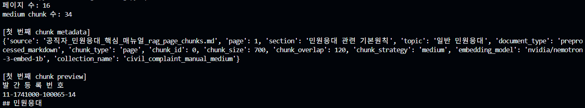
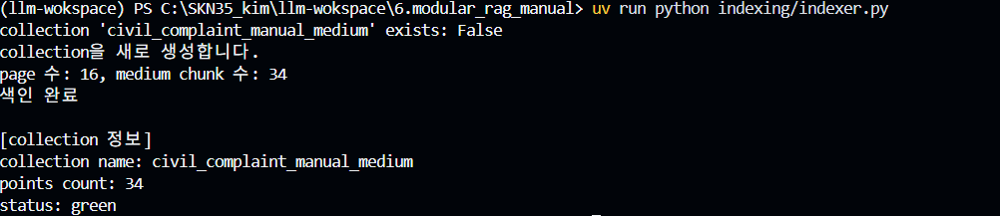
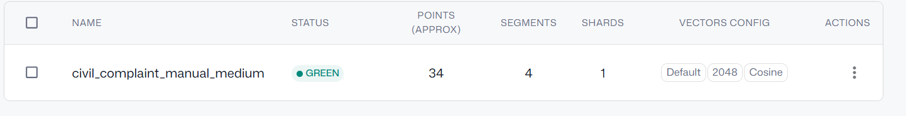
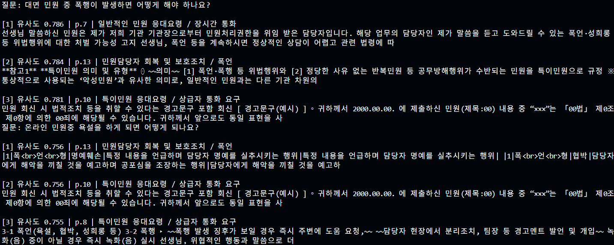
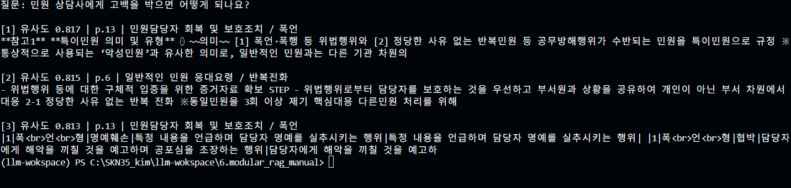

# 과제1 - RAG 청킹 & 벡터 DB 저장

## 1. 과제 목표
공직자 민원응대 핵심 매뉴얼 PDF 문서를 바탕으로, RAG(검색 증강 생성) 파이프라인의 기초 단계인 문서 청킹, NVIDIA 임베딩 변환, Qdrant 벡터 데이터베이스 색인 및 유사도 검색을 직접 구현하고 검색 품질을 검증한다.

## 2. 전체 흐름
PDF → Markdown 전처리 → 청킹 → 임베딩(NVIDIA) → Qdrant 벡터 DB 저장 → 유사도 검색
- **청킹 (Chunking)**: 긴 매뉴얼 문서를 적절한 크기(700자, 오버랩 120자)로 분할하여 문맥 단절을 방지하고 검색 정확도를 높임.
- **임베딩 (Embedding)**: 분할된 텍스트 청크를 의미 기반의 고차원 숫자 벡터(NVIDIA Nemotron-3 2048차원)로 변환함.
- **Qdrant (Vector DB)**: 변환된 벡터와 원본 메타데이터를 저장하고, 질문 벡터와의 코사인 유사도 거리 계산을 통해 가장 가까운 문서를 빠르게 검색함.

## 3. 실행 결과
- **페이지 수**: 16페이지 → **청크 수**: 34개 (chunk_size: 700, chunk_overlap: 120)
- **Qdrant 컬렉션**: `civil_complaint_manual_medium` (points count: 34 / status: green / dim: 2048)

### [스크린샷 1] 청킹 실행 결과 (`medium chunk 수: 34`)

### [스크린샷 2] Qdrant DB 색인(임베딩) 완료 (`points count: 34`, `status: green`)

### [스크린샷 3] Qdrant 대시보드 컬렉션 확인

## 4. 검색 실험 결과 및 비교 분석
직접 질문 3개를 선정하여 `search_test.py`로 유사도 검색을 수행하고 정답과 비교 분석하였다.

| # | 질문 | 정답 페이지 | 검색 1위 | 정답 순위 | 결과 분석 및 이유 |
|---|---|---|---|---|---|
| **1** | 대면 민원 중 폭행이 발생하면 어떻게 해야 하나요? | **p.8** (폭행 대응 지침) | **p.7** (유사도 0.786) | 4위권 | p.7에도 '폭언·위법행위 처벌 가능성 고지' 문구가 포함되어 있고, '위법행위', '대응' 등의 키워드가 중복 등장하여 p.7, p.13이 상위에 먼저 잡힘. 키워드가 유사한 인접 페이지 간의 변별력을 높이기 위한 리랭킹(Reranking)의 필요성을 느낌. |
| **2** | 온라인 민원중 욕설을 하게 되면 어떻게 되나요? | **p.10** (경고문구 회신) / **p.13** (특이민원 정의) | **p.13** (유사도 0.756) | **1위** (공동 1위권 p.10) | '욕설'이라는 단어에 대해 법적 유형(폭언형 명예훼손·모욕 등)을 규정한 p.13과 온라인/서면 민원에 대한 법적조치 경고문구가 적힌 p.10(0.756)이 정확히 최상위로 검색됨. |
| **3** | 민원 상담사에게 고백을 박으면 어떻게 되나요? | **p.13** (성희롱형 특이민원: 성적 수치심/사적 발언) | **p.13** (유사도 0.816) | **1위** (0.816) | 매뉴얼에 '고백을 박다'라는 직접적인 표현은 없으나, 시맨틱 임베딩 모델이 문맥상 업무 방해 및 '성희롱/특이민원' 맥락으로 의미를 정확히 파악하여 p.13과 p.6(반복전화 방해)을 최상위로 매칭함. 단어 불일치 상황에서도 의미 기반 검색이 뛰어남을 확인. |

### [스크린샷 4] 내 질문 검색 실행 결과

## 5. 막힌 점 → 해결 (Troubleshooting)

| 문제 상황 | 원인 | 해결 방법 |
|---|---|---|
| `ModuleNotFoundError: No module named 'langchain_qdrant'` | 가상환경에 Qdrant 관련 라이브러리 미설치 | `uv add langchain-qdrant qdrant-client langchain-text-splitters` 명령어로 패키지 설치 |
| OpenAI 대신 NVIDIA API 사용 시 `410 Gone (Model EOL)` 에러 | 기존 `nv-embedqa-e5-v5` 모델이 서비스 종료됨 | 현재 지원되는 최신 임베딩 모델 `nvidia/nemotron-3-embed-1b`로 모델명 교체 및 연동 |
| LangChain `OpenAIEmbeddings` 호출 시 `sequence token` 에러 | LangChain이 NVIDIA API에 문자열 대신 토큰 시퀀스를 전달함 | `check_embedding_ctx_length=False` 옵션을 추가하여 순수 텍스트 리스트가 전달되도록 수정 |
| 터미널 출력 시 `UnicodeEncodeError: 'cp949'` 에러 | 특수문자(`\u25e6` 등) 출력 시 Windows CP949 인코딩 충돌 | `search_test.py` 내 출력 스트림을 UTF-8로 재구성(`sys.stdout.reconfigure(encoding='utf-8')`)하여 해결 |

## 6. 배운 점
1. **키워드 검색과 시맨틱(의미) 검색의 차이**: '고백을 박으면'처럼 문서에 없는 일상어나 은어를 써도 임베딩 모델이 '성희롱/업무방해 특이민원'이라는 본질적인 의미를 포착해 정답 문서를 찾아내는 RAG의 강력함을 체감함.
2. **청크 분할 및 메타데이터의 중요성**: 유사한 단어가 여러 페이지에 흩어져 있을 경우 오답 청크가 상위에 올 수 있으므로, 청크 크기와 오버랩 튜닝, 그리고 검색 후 정답을 다시 정렬해주는 리랭커(Reranker)의 필요성을 이해함.
3. **다음 프로젝트 연계**: 이번 과제에서 구축한 Qdrant 벡터 검색기를 다음 단계의 LLM 생성 모델(NVIDIA `gpt-oss-20b`)과 결합하면 민원 응대 전문 RAG 챗봇을 완성할 수 있을 것으로 기대됨.
